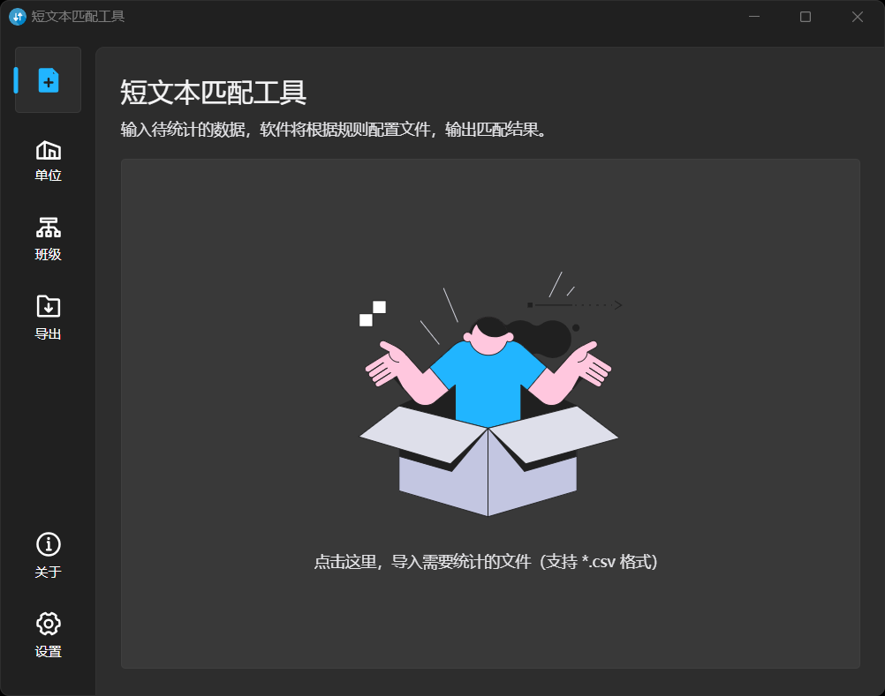
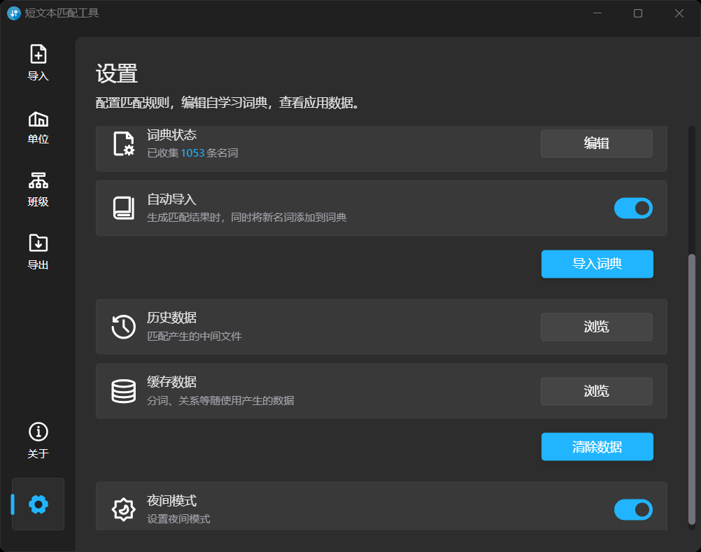

# Sentence Matching Toolkit

A Chinese short text matching tool.

```bash
# typos
做物 → 作物
洒店 → 酒店
保肓 → 保育
```

Powered by Tauri, React and Typescript in Vite.

## Preview






## Recommended IDE Setup

- [VS Code](https://code.visualstudio.com/) + [Tauri](https://marketplace.visualstudio.com/items?itemName=tauri-apps.tauri-vscode) + [rust-analyzer](https://marketplace.visualstudio.com/items?itemName=rust-lang.rust-analyzer)

## References

- [Iconpark Illustration 1](https://iconpark.oceanengine.com/illustrations/1)
- [Convert SVG to React component](https://react-svgr.com/playground/)
- [snippet generator](https://snippet-generator.app/)
- [updating dependencies](https://tauri.app/v1/guides/development/updating-dependencies/#update-npm-packages)
